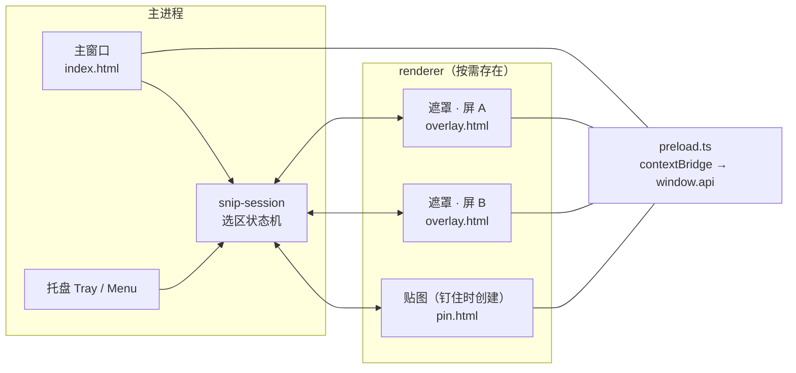
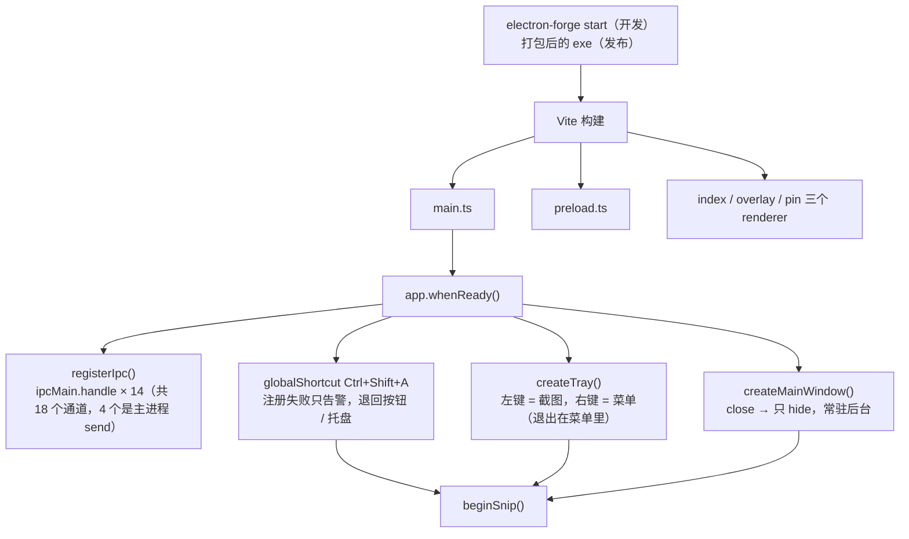
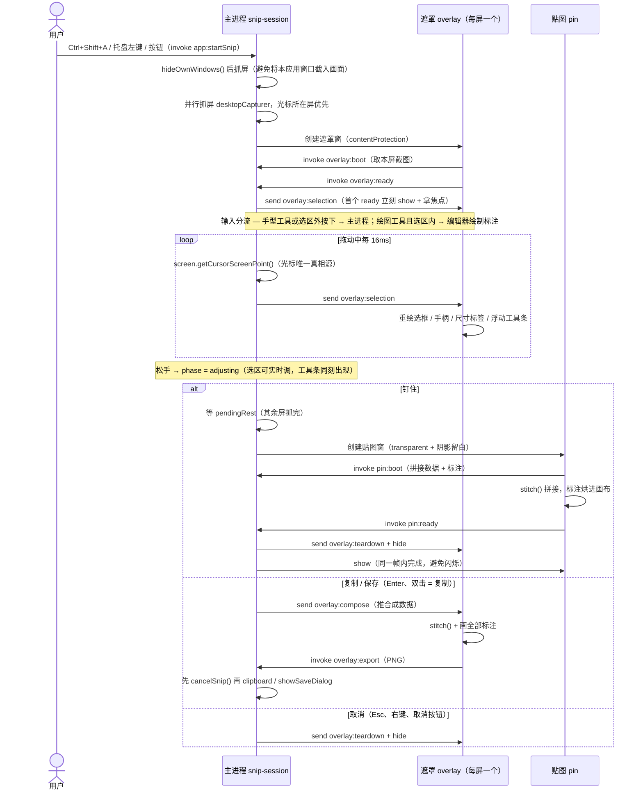
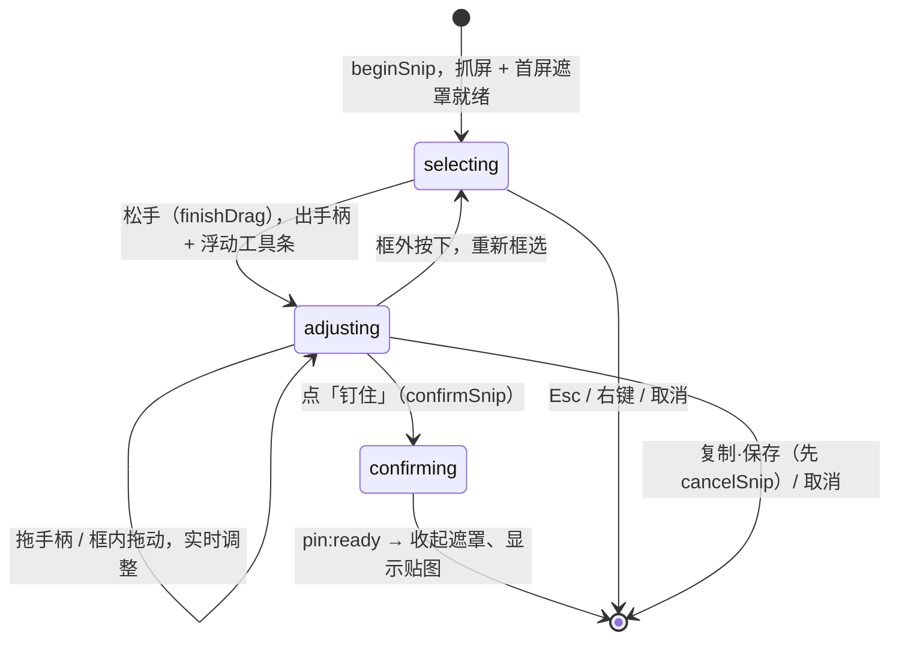

# 架构与调用逻辑

本文说明一次截图从触发到结束，主进程与三个 renderer 之间的调用关系。

## 文件结构

```
src/
  main.ts                主进程入口：主窗口、托盘、全局快捷键
  preload.ts             contextBridge，三个窗口共用同一份
  global.d.ts            window.api 类型
  shared/
    channels.ts          IPC 通道名唯一来源（不写字符串字面量）
    types.ts             Rect / DisplayShot / Shape / 各类 payload
    pin-layout.ts        贴图窗口的阴影留白上限 / 最小尺寸（主进程与渲染进程共用）
    api.ts               ScreenshotsApi，preload 与渲染进程共用
    bytes.ts             Uint8Array → Blob
    stitch.ts            跨屏拼接（遮罩与贴图共用）
    selection.ts         选区 8 向手柄几何（主进程判定 + 遮罩绘制/光标共用）
  main-process/
    capture.ts           抓屏：按目标尺寸分组取源，回读实际尺寸算比例（可只抓指定屏）
    snip-session.ts      选区状态机：遮罩生命周期、选区、确认/取消
    overlay-window.ts    遮罩窗口（每屏一个，按 displayId 缓存复用）
    pin-window.ts        贴图窗口（透明 + 关闭）、复制、保存
    ipc.ts               ipcMain 注册
    tray.ts              托盘
    renderer-log.ts      渲染进程 console 转发到主进程
  annotations/           标注引擎（遮罩在用；钉住后是只读贴图）
    editor.ts            标注编辑器：历史、选中/调整、指针、文字
    shapes.ts            各图形绘制 + 马赛克 + 命中检测 + 包围盒/手柄
    toolbar.ts / .css    工具条（动作组由宿主注入）
  overlay/
    overlay.ts / draw.ts 遮罩渲染：截图 + 遮罩 + 选框/手柄 + 浮动工具条 + 放大镜
  pin/
    pin.ts               贴图入口：拼图 + 烘标注 + 关闭按钮 + 快捷键
    pin.css              透明窗口 / 阴影留白定位 / 关闭按钮
index.html               renderer 入口：主窗口
overlay.html             renderer 入口：遮罩
pin.html                 renderer 入口：钉图
```

## 窗口与进程

主进程 + 三个 renderer，共用同一份 preload：



- **遮罩**：每块屏一个窗口（`bounds` 严格等于 `display.bounds`），不是单窗横跨多屏 —— 混合 DPI 下单窗的 `devicePixelRatio` 语义是模糊的。
- **贴图**：只有点「钉住」才创建，创建后按 `displayId` 之外的逻辑不再复用（每个贴图是独立窗口）。
- **托盘常驻**：主窗口 `close` 只 `hide()`，`window-all-closed` 不退出。

## 启动



## 一次截图的调用链



`boot` / `ready` / `pin:boot` 都用 `invoke` 而不是 `send`，是为了避开「主进程先发、渲染进程还没订阅」的竞态。

## 选区阶段



三个阶段的 `phase` 定义在 `src/shared/types.ts` 的 `SnipPhase`；选区状态**只存在主进程**（虚拟屏 DIP 坐标，可为负），遮罩是纯投影。

## IPC 通道方向

- **主 → 渲染**（`send`）：`overlay:selection`、`overlay:teardown`、`overlay:compose`、`app:state`
- **渲染 → 主**（`invoke`）：`overlay:boot`、`overlay:ready`、`overlay:input`、`overlay:tool`、`overlay:action`、`overlay:shapes`、`overlay:editState`、`overlay:focus`、`overlay:copyText`、`overlay:export`、`pin:boot`、`pin:ready`、`pin:action`、`app:startSnip`

共 18 个通道（14 个 `invoke` + 4 个 `send`），全部定义在 `src/shared/channels.ts` —— 任何地方都不允许写字符串字面量。
